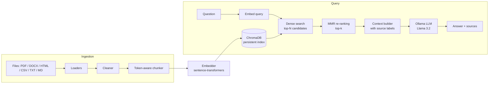

# Local RAG Pipeline

A modular, local-first **Retrieval-Augmented Generation (RAG)** pipeline in Python. Ingest your own documents, index them in a persistent vector store, and ask questions that are answered by a local LLM with **source citations**. Everything runs on your machine: no API keys, no data leaving your laptop.

```
documents → load → clean → chunk → embed → ChromaDB → retrieve (MMR) → LLM → cited answer
```

## Features

- **Multi-format ingestion:** PDF (page-aware), DOCX, HTML, CSV, TXT and Markdown, with recursive directory scanning and per-file error isolation.
- **Text cleaning:** Unicode NFC normalization, ligature expansion, control-character removal and whitespace collapsing to fix common PDF extraction artefacts.
- **Token-aware chunking:** recursive splitter that measures chunks with `tiktoken` (default 512 tokens, 64 overlap) instead of characters.
- **Incremental ingestion:** SHA-256 file fingerprints skip files that were already ingested; `--force` re-ingests.
- **Embeddings:** `sentence-transformers` (default `all-MiniLM-L6-v2`) with batched encoding and automatic MPS / CUDA / CPU selection.
- **Persistent vector store:** ChromaDB with cosine similarity, idempotent upserts and metadata filtering.
- **MMR re-ranking:** Maximal Marginal Relevance over a larger candidate pool to return relevant *and* non-redundant context.
- **Local generation:** Llama 3.2 via [Ollama](https://ollama.com), with streaming and non-streaming modes and a grounded prompt that cites `[Source n]`.
- **Typed configuration:** all settings live in one YAML file, validated with Pydantic.

## Architecture



## Project structure

```
.
├── cli/
│   └── ingest.py            # Click + Rich CLI: ingest, --stats, --clear
├── config/
│   └── settings.yaml        # Central configuration
├── src/rag/
│   ├── config.py            # Pydantic settings loader
│   ├── rag_pipeline.py      # RAGPipeline: ingest() / query() / stream()
│   ├── ingestion/
│   │   ├── loaders.py       # PDF, DOCX, HTML, CSV, TXT, MD loaders
│   │   ├── cleaner.py       # Text normalization
│   │   ├── chunker.py       # Token-aware recursive chunker
│   │   └── pipeline.py      # Load → clean → chunk + fingerprint registry
│   ├── embedding/
│   │   └── embedder.py      # Sentence-transformers wrapper
│   ├── vectorstore/
│   │   └── store.py         # ChromaDB wrapper
│   ├── retrieval/
│   │   └── retriever.py     # Dense retrieval + MMR + context formatting
│   └── generation/
│       └── llm.py           # Ollama client + prompt templates
├── requirements.txt
└── pyproject.toml
```

## Quick start

### 1. Prerequisites

- Python 3.10+
- [Ollama](https://ollama.com/download) installed and running

### 2. Install

```bash
git clone https://github.com/Vikramsrini/RAG.git
cd RAG

python -m venv .venv
source .venv/bin/activate
pip install -r requirements.txt
```

### 3. Pull a local model

```bash
ollama pull llama3.2
ollama serve            # skip if the Ollama app is already running
```

### 4. Ingest documents

Put files in `data/documents/` (created automatically on first run), or point the CLI at any file or folder:

```bash
export PYTHONPATH=src

python -m cli.ingest ./data/documents      # ingest a folder (recursive)
python -m cli.ingest ./report.pdf          # ingest a single file
python -m cli.ingest ./data --force        # re-ingest even if already seen
python -m cli.ingest --stats               # show knowledge-base statistics
python -m cli.ingest --clear               # wipe the knowledge base (asks to confirm)
python -m cli.ingest ./data -v             # verbose / debug logging
```

### 5. Ask questions

```python
from rag.rag_pipeline import RAGPipeline

pipeline = RAGPipeline()

response = pipeline.query("What are the key findings of the report?")
print(response.answer)

for chunk in response.sources:
    page = f", page {chunk.page}" if chunk.page else ""
    print(f"[{chunk.rank}] {chunk.source}{page}  (score: {chunk.score:.3f})")
```

Run it from the repo root with `PYTHONPATH=src` set (as above).

**Streaming**

```python
sources, tokens = pipeline.stream("Summarize the main argument")
for token in tokens:
    print(token, end="", flush=True)
```

**Filtering by metadata**

Every chunk carries `source`, `filename`, `page` (PDFs), `doc_type`, `chunk_index` and `token_count`.

```python
pipeline.query("What is the refund policy?", metadata_filter={"doc_type": "pdf"})
pipeline.query("Summarize this", metadata_filter={"filename": "report.pdf"}, top_k=8)
```

## Configuration

All settings are in [`config/settings.yaml`](config/settings.yaml). Set `RAG_CONFIG=/path/to/other.yaml` to use a different file.

| Section | Key | Default | Meaning |
|---|---|---|---|
| `embedding` | `model_name` | `all-MiniLM-L6-v2` | Any sentence-transformers model |
| `chunking` | `chunk_size` / `chunk_overlap` | `512` / `64` | Tokens per chunk / overlap between chunks |
| `chunking` | `min_chunk_size` | `50` | Chunks shorter than this are dropped |
| `vectorstore` | `distance_metric` | `cosine` | `cosine`, `l2` or `ip` |
| `retrieval` | `top_k` | `5` | Chunks passed to the LLM |
| `retrieval` | `use_mmr` / `mmr_lambda` / `mmr_fetch_k` | `true` / `0.5` / `20` | MMR on/off, relevance-vs-diversity trade-off, candidate pool size |
| `retrieval` | `score_threshold` | `0.0` | Minimum similarity to keep a result |
| `llm` | `model` / `temperature` | `llama3.2` / `0.1` | Ollama model and sampling temperature |
| `ingestion` | `skip_existing` | `true` | Skip files whose fingerprint is unchanged |

## Design notes

- **Why token-aware chunking?** Character counts don't match what the model sees. Counting tokens with `tiktoken` keeps chunks within a predictable size budget.
- **Why MMR?** Plain top-k often returns near-duplicate passages. MMR fetches a wider candidate pool and greedily picks chunks that balance relevance to the query against similarity to what is already selected, so the LLM gets broader context in the same prompt budget.
- **Why a local stack?** Ollama + ChromaDB + sentence-transformers need no API keys and keep documents private.
- **Grounded prompting.** The system prompt restricts the model to the retrieved passages, asks it to cite `[Source n]`, and tells it to say so when the answer isn't in the documents.
- **Idempotent writes.** Chunk IDs are derived from the source path, page and chunk index, so re-ingesting the same content updates chunks in place instead of duplicating them.

## Tech stack

Python · sentence-transformers · ChromaDB · Ollama (Llama 3.2) · tiktoken · Pydantic · PyMuPDF · python-docx · BeautifulSoup · Click · Rich

## Roadmap

- [ ] Evaluation harness (retrieval hit-rate@k / MRR, answer faithfulness, latency) with a small golden question set
- [ ] Provider-agnostic LLM layer (OpenAI, Anthropic, Azure OpenAI alongside Ollama)
- [ ] Alternative vector backends (pgvector, Qdrant)
- [ ] Unit tests and CI (ruff + pytest)
- [ ] Dockerfile and a simple web UI

## License

Add a license of your choice (for example MIT) before sharing publicly.
